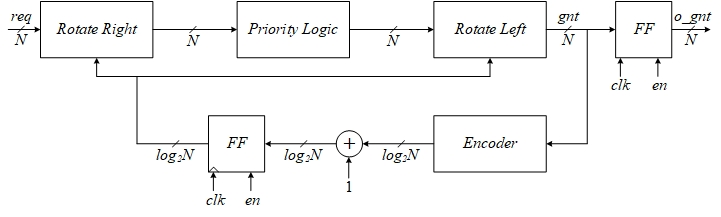
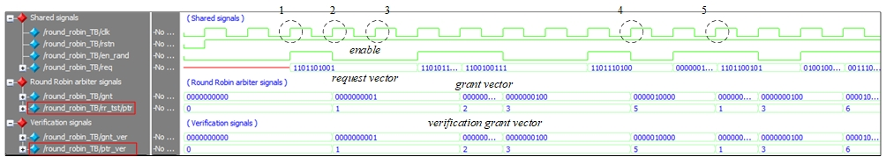

# Round Robin Arbiter

> SystemVerilog Round Robin arbiter  

## Get Started

The source files  are located at the repository root:

- [Round Robin arbiter module](./round_robin.sv)
- [Round Robin arbiter TB](./round_robin_TB.sv)

##
This repository containts a SystemVerilog implementation of a parametrized Round Robin arbiter with three instantiation options:

**TYPE=0 :** Conventional rotating scheme. Pointer is increased by one after each arbitration.

**TYPE=1 :** Modified rotating scheme. Pointer is updated according to the winning requester at the end of each arbitration.

 

**TYPE=2 :** Weighted rotating scheme. Winning requested is chosen based on both the instantaneous weights status and the pointer location.

 

## Testbench
In the following testbenches the following variables were randomized:
1. enable signal - Arbitration is carried only when the enable signal is logic high at the capturing clock edge (rising).
2. request vector - N-bit request vector is generated and routed to both the arbiter module as well as the verification logic.

### Conventional rotating scheme (N=8)

 

As can be seen,	when the enable signal is logic high at the rising edge of the clock a new request vector is generated and arbitration is carried. Since this is a standard circular realization, the 'priority' vector (marked in red) changes in a circular manner. 

 

**Examplary events marked on the zoom-in figure:**
1) Priority pointed is not modified since the enable signal is logic low
2) The enable signal is logic high, therefore arbitration is carried. The pointer's value is '4', however only req[1] is logic high and therefore the grant vector matched the request vector.
3) The enable signal is logic high, therefore arbitration is carried. The pointer's value is '5' but req[5] is logic low (i.e. the requester with the instantaneous priority does not request access to the shared resource) the access is given to the next in line which is requester '6'.
4) Priority pointed is not modified since the enable signal is logic low
5) The enable signal is logic high, therefore arbitration is carried. The pointer's value is '6' and req[6] is logic high, therefore the requester with the instanteous priority is given access to the shared resource.
6) Please note that the pointer value is updated to '0' for the  8-requesters scenario shown here. 

Please run the testbench and observe the teminal messages for in-depth understanding, for example:

 

### Modified rotating scheme  (N=10)

 
	
As can be seen,	when the enable signal is logic high at the rising edge of the clock a new request vector is generated and the priority pointer is modified. Since this is a standard circular realization, the 'priority' vector (marked in red) changes in a circular manner. 

### Weighted rotating scheme
XXX

## Support

I will be happy to answer any questions.  
Approach me here using GitHub Issues or at tom.urkin@gmail.com