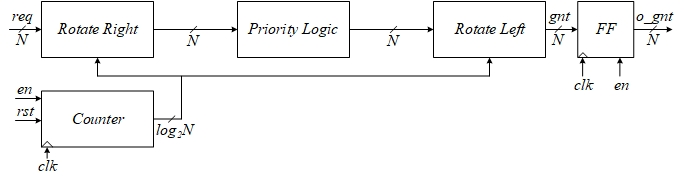
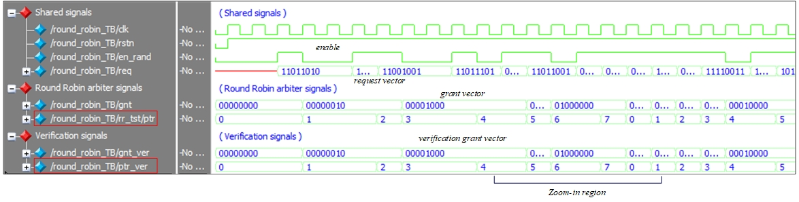
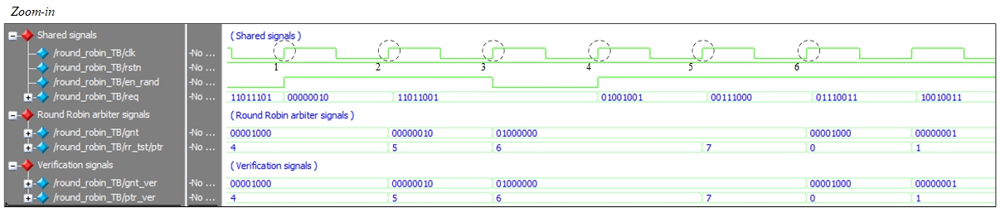

# Round Robin Arbiter

> SystemVerilog Round Robin arbiter  

## Get Started

The source files  are located at the repository root:

- [Round Robin arbiter module](./round_robin.sv)
- [Round Robin arbiter TB](./round_robin_TB.sv)

##
This repository containts a SystemVerilog implementation of a parametrized Round Robin arbiter with three instantiation options:

TYPE=0 : Conventional rotating scheme. Pointer is increased by one after each arbitration.
	

TYPE=1 : Modified rotating scheme. Pointer is updated according to the winning requester at the end of each arbitration. 
	 

TYPE=2 : Weighted rotating scheme. Winning requested is chosen based on both the instantaneous weights status and the pointer location. 
	 

## Testbench
In the following testbenches the following variables were randomized:

1. enable signal - Updating the priority vector is carried only when the enable signal is logic high at the capturing clock edge (rising).
2. request vector - N-bit request vector is generated and supplied to both the arbiter module as well as the verification logic.

### Conventional rotating scheme (N=8)

 
	
As can be seen,	when the enable signal is logic high at the rising edge of the clock a new request vector is generated and the priority pointer is modified. Since this is a standard circular realization, the 'priority' vector (marked in red) changes in a circular manner. 

 

Examplary events marked on the zoom-in figure:
1) Priority pointed is not modified since the enable signal is logic low
2) At this rising clock edge the enable signal is high and the priority pointer is increased to '4'. Since the req[4] bit is logic high, the grand vector is 8'b00010000.
3) Priority pointed is not modified since the enable signal is logic low
4) At this rising clock edge the enable signal is logic low, therefore the priority vector is not modified. However, since it changes to logic high at this edge, a random request vector is generated which happens to be with only one logic high bit, which results in a grant vector that matches the request vector.  
5) At this rising clock edge the enable signal is logic high, therefore the priority vector is modified to '6'. Since req[6] is logic high, request number 6 is granted access to the shared resouece. Please note the the grant vector did not change from its preceeding value since requester number 5 did not request access to the shared resouce.
6) At this eising clock edge the enable signal is logic high, therefore the priority vector is modified. Please note that it's value changes from '7' to '0' for this case of N=8.

Please run the testbench and observe the teminal messages for in-depth understanding, for example:
 

### Modified rotating scheme 
XXX

### Weighted rotating scheme
XXX

## Support

I will be happy to answer any questions.  
Approach me here using GitHub Issues or at tom.urkin@gmail.com